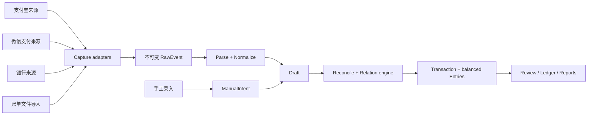

# 系统架构地图

- 状态：部分实现；本地账本、通用显式文本/CSV/TSV 证据、用户确认对账、受控通知边界、4 条默认关闭的 provider 实验 route、route 控制面、持久观察去重与实验性随包 OCR 已实现；Room、合成 OCR 与 11 张本机私有真实页面回放已有 S24U-HK 证据，通知 callback、真实简中页面和完整资源发布门待验证
- 所有者：项目维护者
- 最后核验：2026-08-01
- 事实来源：当前 Gradle/Room 工程、项目负责人范围修正、`docs/design-docs/` 下的细化文档、[ADR-0005](docs/decisions/0005-manual-ledger-first-slice.md)、[ADR-0006](docs/decisions/0006-provider-neutral-shared-text-evidence-spine.md)、[ADR-0007](docs/decisions/0007-source-evidence-lifecycle-and-bounded-storage.md)、[ADR-0008](docs/decisions/0008-leased-source-evidence-staging-and-orphan-recovery.md)、[ADR-0009](docs/decisions/0009-wallet-balance-not-inferred-from-bank.md)、[ADR-0010](docs/decisions/0010-notification-first-capture-and-single-receipt-fallback.md)、[ADR-0011](docs/decisions/0011-local-resource-budget-first-capture.md)

本文只描述稳定边界。实体字段、解析规则和 UI 细节分别由 [领域模型](docs/design-docs/domain-model.md)、[来源适配器](docs/design-docs/ingestion-and-source-adapters.md) 与 [产品规格](docs/product-specs/index.md) 维护。

## 架构目标

- 无网络时完成采集后的解析、记账、查询、对账和导出。
- 将支付宝、微信支付和银行差异限制在来源适配器内部。
- 保留原始证据，使解析器和规则升级后能够安全重放。
- 用共享的关联引擎识别同一经济事件，避免渠道与资金账户重复记账。
- 对敏感数据实施最小权限、最少复制和可验证删除。

## 顶层数据流



采集成功不代表入账成功。所有外部输入先成为可追溯证据，再由共享领域规则决定其经济含义。

手工输入不是外部采集证据：当前实现把它直接建模为 ManualIntent/Draft，不创建假的 `RawEvent`。显式分享文本、不透明小型文本文件和用户映射 CSV/TSV 则走已实现的来源中立证据链：

```text
ACTION_SEND text/plain / SAF OpenDocument(text/plain, CSV, TSV)
  -> leased staging reservation
  -> bounded app-private evidence
  -> immutable RawEvent
  -> GenericShareTextParser or GenericSelectedTextFileParser / ParseAttempt
  -> source draft proposal
  -> user-completed external Draft
  -> Transaction + balanced Entries

SAF OpenDocument(CSV, TSV) + explicit column mapping
  -> bounded process-local document
  -> ImportBatch(file hash + mapping hash)
  -> one immutable row evidence / RawEvent per valid row
  -> GenericDelimitedStatementParser / ParseAttempt
  -> source draft proposal with amount, direction, time and counterparty candidates
  -> user-completed external Draft
  -> Reconcile or Transaction + balanced Entries
```

通用入口标记为 `GENERIC/SHARE_TEXT`、不透明 `GENERIC/STATEMENT_IMPORT` 或逐行 `GENERIC/STATEMENT_IMPORT`。自由文本不猜支付宝、微信、银行、金额或账户；结构化路径也只采用用户明确确认的列、格式、方向值和币种，不按表头猜 provider。所有 SAF 路径都不保存 URI/文件名。支付宝、微信和招商银行已有首批窄范围、默认关闭的通知适配器，但专属文件适配器、完整事件覆盖和真机 callback 证据仍未完成；三类来源在运行时继续显示 `FALLBACK_REQUIRED`。

## 当前实现断面

账本断面为 CNY/USD：现金、支付宝余额和微信零钱仅 CNY；银行卡和信用卡可为 CNY 或 USD；总览按币种分开，不提供汇率换算。创建账户后以平衡 `ADJUSTMENT` 表示期初余额；手工或来源 Draft 选择同币种资金账户后再确认成平衡 Entries。Room schema v7 持久化账户、草稿、交易、分录、RawEvent、ParseAttempt、来源建议、Draft 证据链接、载荷生命周期/保留策略、暂存租约、通知观察摘要、导入批次/行结果、对账链接/关系、审计与幂等命令回执，状态 Flow 驱动总览、账户、草稿和流水。

账本内部约定资产/费用增加为正，负债/收入/权益增加为负；信用卡欠款因此存为负数，UI 再转换为用户视角的正数。未分类费用、未分类收入与期初权益使用隐藏系统账户，不得出现在资金账户选择或净资产账户列表中。撤销把交易标记为 `VOIDED`、从余额汇总排除，并把来源 Draft 恢复为待复核；不删除交易或 Entries。

来源断面先在 Room 登记 5 分钟暂存租约，再把证据写入 `noBackupFilesDir`；文本载荷限制为 64 KiB 并严格校验 UTF-8，用户显式分享的单张 PNG 收据限制为 4 MiB 并只校验有界 PNG 结构/CRC、不解码像素。两类载荷均校验长度和 SHA-256。独立的 Quick Settings/Photo Picker OCR 只在用户动作后处理一帧或每批前 1–5 张图片，持久化有界转录而非原始像素；空间转录 v2 为每行保留 0..10000 归一化整数边界，v1 文本证据继续可读。解析器先判定完成状态：失败、取消、拒绝、未领取/未打开、处理中、预计到账或待完成时不预填金额或方向；其余页面仍要求独立主金额的边界高度相对正文中位数及其他独立金额明确占优。只有完成上下文和显著版面同时成立时，才允许 OCR 拆开的纯小数行作为主金额；正负号只作用于选中的主金额且要求交易详情上下文。真正的退款/转账/红包/充值/提现不推断普通收支方向，普通付款页上的促销红包文字不改变已完成支出语义。所有结果仍只产生待复核建议。Photo Picker 单飞串行并只汇总一次。截图 command 先持有 90 秒可取消租约；在证据准入、容量清理或写入之前，以 CAS 将 `ACTIVE` 原子转为 `COMMITTING`。CAS 前取消会终止 Job 且不进入任何有副作用的准入路径；cancellation handle 注册中的中间态不会被误判为已取消。CAS 后先释放像素，再在 15 秒协作式截止内运行有界、无网络的本地 admit/stage/parse/Room 路径；此后的超时、取消或非致命异常都返回 `COMMIT_STATUS_UNKNOWN`，交由幂等与暂存恢复确认。提交中或结果已形成但回调缺失时另有一次 15 秒收尾宽限，随后以“结果未确认”释放单飞门；opaque request identity 隔离迟到回调。磁贴/无障碍设置入口深链到 Bill 教程，启动本地声明使用 safe drawing insets 与可滚动布局；这些交互加固不改变 OCR 的 Experimental 状态。RawEvent/生命周期事务原子消费租约；到期租约和旧版孤儿由 CAS 接管与有界扫描恢复。`RawEvent` ID 碰撞、解析/建议/证据链接/载荷生命周期跨表不一致以及损坏载荷均失败关闭。重复哈希只产生用户可见提示，不自动合并；忽略追加审计并保留证据。原始载荷使用两阶段清除、7/30/90 天或永久保留、已提交与暂存共用的 16 MiB/512 份预算和 keyset 分页；自动保留/容量清理不删除待复核载荷，清除后结构化事实链继续保留。

通知 route 控制面只接收静态 catalog 导出的 opaque ID 与安全标签。开启先同步持久化再放行运行时门禁；关闭先通过 volatile 不可变快照收紧本进程门禁，再持久化并在失败时冻结其他开关。失败关闭的跨进程边界会明确披露：若重试仍失败，用户须在退出或重启前撤销 Android 的应用级通知使用权。授权 CTA 只在已启用 route 需要授权，或系统授权仍在需要管理/撤销时出现；健康状态把系统授权与 listener 实际连接分开。当前生产 catalog 含 4 条默认关闭的实验 route；metadata 与正文模板双重通过后，provider parser 会复核 envelope 身份并只生成单一 CNY 金额和方向的来源建议。微信 route 的标题允许 `Weixin Pay` 与 `微信支付` 两个本地化别名，稳定 route ID 不变；金额仍只来自已验证的正文模板，未经真实样本验证的中文正文失败关闭。S24U-HK/API 36 的 app instrumentation 已验证隔离偏好以及当前 4-route catalog 默认关闭、只持久化 opaque opt-in，尚未覆盖系统 callback、provider 语义或资源。

以上是代码实现状态，不是发布支持结论。2026-08-01 完整 `test lint assembleDebug assembleRelease :data:local:assembleDebugAndroidTest :ocr:paddle:assembleDebugAndroidTest :app:assembleDebugAndroidTest` 成功（891 个 actionable tasks：71 executed、820 up-to-date），覆盖全部 JVM、Lint、Debug/未签名 Release 分包和三组 AndroidTest APK 编译；arm64-v8a/x86_64 分包也重新通过 16 KiB ZIP 对齐。简繁体/状态门修复后的 `generic-photo-ocr`、WeChat、application 与 app 定向 169-task 套件全部强制执行通过。S24U-HK/API 36 的 app 14/14 只覆盖 Debug 采样、偏好隔离和当前 catalog 默认关闭；没有系统 callback。该设备的 `data:local` 47/47 已覆盖 v1→v7、结构化导入/对账/通知观察/证据仓储，随包 OCR 合成三语 1/1 证明模型和原生运行时可加载、推理与释放；另有合成多金额空间链 1/1、本机私有真实繁中/英文过程页 11/11 与简中四状态页 1/1。真实简中微信页面、系统截图/选图 UI、Release 资源、签名发行、ELF 页兼容、新 route callback/更新/重启、投资、自动化 UI/系统强杀和完整真机矩阵不在已验证断面内。

## 建议模块边界

| 层/模块 | 责任 | 允许依赖 |
| --- | --- | --- |
| `app` | Android 组装根、导航、分享 Intent 生命周期与手工依赖装配 | `feature:*`、`application`、`data:local`、`source:*` |
| `feature:*` | 草稿箱、确认、账户、流水与总览 UI | `application`、`core:designsystem` |
| `application` | 账本/分享用例编排、输入门、证据保留/容量策略与状态投影 | `core:domain` ports、`core:ledger`、来源端口 |
| `core:model` | 金额、账户类型、交易类型与分录值对象 | Kotlin 标准库 |
| `core:domain` | 首片领域实体、状态与仓储端口 | `core:model`、Kotlin Coroutines |
| `core:ledger` | 平衡校验与过账构造 | `core:model`、`core:domain` |
| `core:domain` + `application` 对账切片 | 转账、信用卡还款、退款候选与用户确认编排；不自动合并 | `core:model`、`core:ledger`、来源复核端口 |
| `source:contract` | 证据、RawEvent、解析身份、候选与安全诊断契约 | Kotlin 标准库 |
| `source:pipeline` | 解析器注册、证据读取、不可变提交与 ParseAttempt 编排 | `source:contract` |
| `source:review-contract` | 来源建议、Draft 证据链接、载荷生命周期与审计端口 | `source:contract`、`core:domain` |
| `source:generic-share-text` | 通用分享文本的最小、非推断解析器 | `source:contract` |
| `source:generic-delimited-statement` | 严格 CSV/TSV 读取、用户映射、行证据 codec 与来源中立解析 | `source:contract` |
| `ocr:paddle` | 静态随包 PP-OCRv6/ONNX/OpenCV 原型；只由用户动作触发 | Android SDK、本地模型 |
| `source:alipay` | 支付宝通知/导入格式适配 | source:contract |
| `source:wechat` | 微信支付通知/导入格式适配 | source:contract |
| `source:bank:*` | 银行通知和文件配置/适配器 | source:contract |
| `data:local` | Room v7、迁移、账本/来源/生命周期/暂存/通知观察/导入批次/对账仓储与应用私有证据文件 | `core:domain` 与来源端口 |
| `platform:android` | 通知监听、SAF、WorkManager、Keystore | Android SDK、source:contract |
| `security` | 加密、密钥、脱敏、导出封装 | 平台抽象 |

禁止依赖：

- 来源适配器直接依赖 Room 实体或写入正式账本。
- UI 直接解析通知或账单文件。
- 通用关联规则依赖支付宝、微信或某家银行的具体文案。
- 领域核心依赖 Android 类、网络 SDK 或第三方分析 SDK。

## 来源契约

每个来源实现相同的四段契约：

1. `Capture`：取得通知或用户选择的文件，并记录来源、时间、内容摘要与必要的证据定位。通知包名/渠道/类别只用于瞬时门禁，不进入 RawEvent、文件名或诊断。
2. `Parse`：把来源结构转换成有证据定位的候选字段；不做账务结论。
3. `Normalize`：输出统一金额、币种、方向、时间、对手方、付款方式提示和外部 ID。
4. `Diagnose`：对未知版本、缺字段、权限关闭和重复输入给出可执行诊断。

来源适配器的功能矩阵和验收门见 [数据源覆盖矩阵](docs/product-specs/source-coverage.md)。

## 账务核心

- `RawEvent`：不可变采集证据，可被多次解析。
- `Draft`：某次解析和规则运行后的候选，可编辑、驳回或关联。
- `Transaction`：经确认的经济事件，如支出、收入、转账、还款或申购。
- `Entry`：交易对账户的借贷/增减影响；同币种交易必须平衡。
- `TxRelation`：表达 `DUPLICATE_OF`、`FUNDED_BY`、`REFUNDS`、`TRANSFER_PAIR`、`REPLACES` 等关系。

当前已实现账户、Manual/外部来源 Draft、Transaction/Entry、Audit、`RawEvent -> ParseAttempt -> source proposal -> draft_source_evidence` 证据链，以及用户确认的 `TRANSFER`、`LIABILITY_REPAY`、`REFUND` 对账切片。应用只在金额、币种、方向、账户角色和时间窗满足硬门时生成有限建议，用户确认后原子写入平衡交易、Draft 链接和关系；撤销会恢复相关 Draft。一般 `DUPLICATE_OF`、多证据自动合并、投资和 provider 适配仍未实现；“可能重复”只是复核信号。

渠道作为交易元数据；只有真实持有余额时，支付宝余额或微信零钱才是资产账户。绑卡支付时，银行/信用卡才是资金账户；钱包余额内收付没有银行资金腿，不能由银行卡流水或余额差推断。

## 存储与安全边界

- 结构化数据进入应用私有 Room/SQLite；分享文本、不透明文件和 CSV/TSV 行证据进入 `noBackupFilesDir`。设置页已提供逐项清除、保留期限、容量治理和分页；Room v5 提供租约暂存与有界孤儿回收，v6 增加不含通知 key/正文的观察摘要与恢复租约，v7 增加不含单元格的导入批次/行状态和对账关系。全部账本删除、加密备份、压力与真实系统强杀矩阵仍是发布门。
- 目标状态是由 Android Keystore 保护备份密钥，并在数据离开应用私有目录前完成认证加密；当前加密备份、密钥恢复和轮换尚未实现，不得按现有能力宣传。
- 导入使用 Storage Access Framework，不申请广泛文件访问。
- 生产日志只记录事件 ID、规则版本和错误码；不记录金额、商户、账号、通知正文或文件内容。
- MVP 不依赖读取其他 App 私有目录、抓包、Root、默认短信读取、24 小时截屏/录屏或轮询 OCR。通知 listener 仅按系统回调、默认关闭的静态 route、元数据门禁和有界本地证据运行，不读历史或启用保活；Samsung 短信 route 因会在正文前覆盖普通短信、OTP 与私人消息而明确排除。被动无障碍读取仅是待用户明确授权与发行合规审查的研究门，且绝不执行 UI 操作或读取当前版本的屏幕内容。

完整威胁与权限模型见 [SECURITY.md](docs/SECURITY.md)。

## 可机械执行的约束

当前已机械执行：

- `scripts/check-architecture.ps1` 以显式允许表检查 Gradle 直接项目依赖、未知模块、逆向依赖、循环，以及 JVM-only 模块的 Android 插件/API 泄漏。
- `scripts/check-sensitive-boundaries.ps1` 检查生产 Kotlin/Java 的直接日志/控制台输出、直接遥测依赖，以及源 Manifest 新增的网络、短信、广泛存储等高风险权限；`tools:node="remove"` 作为显式移除处理。
- `scripts/check-docs.ps1` 检查文档结构、元数据、相对链接、孤儿文档和三类同级来源约束。
- `scripts/generate-repository-facts.ps1 -Check` 校验 [仓库生成事实](docs/generated/repository-facts.md) 未陈旧；正反例和字节稳定性由 `scripts/test-repository-checks.ps1` 验证。

Room schema 导出/迁移、分录平衡和去重幂等仍由 Gradle 测试承担。每个真实来源的脱敏黄金样本回放必须随 provider 适配器加入；当前没有样本，不得用生成事实或守卫结果替代。

从仓库根目录经 CMD 运行全部仓库守卫：`cmd.exe /d /s /c scripts\check-repository.cmd`。
