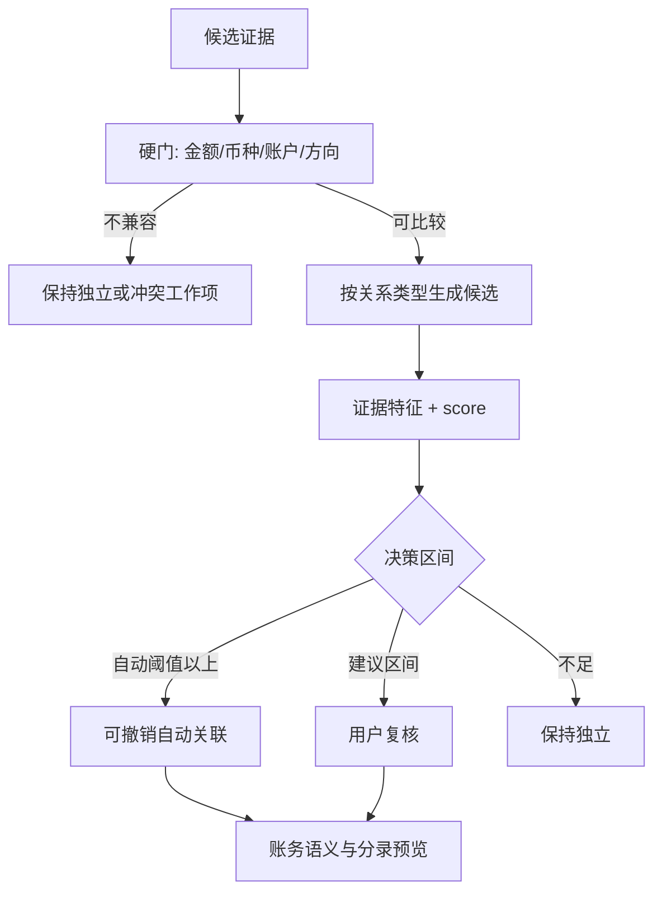

# 去重、关联与资金流设计

- 状态：部分实现；用户确认的转账、信用卡还款、退款与绑卡支付 `FUNDED_BY` 切片已有自动化证据，其他关系与阈值仍待样本校准
- 所有者：项目维护者
- 最后核验：2026-08-01
- 事实来源：原设计报告的关联思路，经多来源与反例扩展；ADR-0009；[ADR-0015](../decisions/0015-immutable-balance-snapshots-and-explicit-differences.md)；[ADR-0016](../decisions/0016-user-reviewed-channel-and-explicit-funded-by.md)；[完整可编辑审核与 FUNDED_BY ExecPlan](../exec-plans/completed/0011-editable-review-ocr-funded-by.md)；当前领域、应用与 Room v11 实现

## 两个不同问题

1. **观测问题**：两份 RawEvent/Draft 是否描述同一底层事件？
2. **账务问题**：该事件应如何影响资产、负债、费用、收入或投资？

必须先判断关系，再决定过账语义。简单“重复行删除”会丢失银行资金证据，简单“每条通知入账”会双计。

## 关系类型

| 关系 | 典型场景 | 账务结果 |
| --- | --- | --- |
| `DUPLICATE_OF` | 同通知重发、同文件行重复 | 只保留一个规范事件，证据均保留 |
| `PENDING_POSTED` | 银行待入账变正式入账 | posted 替代 pending，保留用户编辑 |
| `FUNDED_BY` | 已证实的支付宝/微信绑卡或信用卡直接付款 | 一个支出，银行/信用卡是资金腿；不得用于钱包余额内收付 |
| `WRAPPED_BY` | 支付渠道包装真实资金账户 | 渠道元数据，不增加第二笔收支 |
| `TRANSFER_PAIR` | 自有银行账户相反方向记录 | 一笔转账，不计收入/支出 |
| `REFUNDS` | 全额/部分/多次退款 | 冲减原事件或建立退款事件 |
| `REPAYS` | 银行资产偿还信用卡/贷款 | 减资产与负债，不计第二次支出 |
| `REPLACES` | 更完整证据替代旧候选 | 保留审计与用户编辑 |

## 当前已实现切片

当前只对仍为 `WAITING_USER/EDITED` 的 Draft 生成本机建议，所有建议必须由用户在竖屏确认面板显式确认；没有自动区，也没有把相同金额直接合并：

- `TRANSFER_PAIR`：一条支出 Draft 与一条收入 Draft 金额、币种相同，资金账户是两个不同的本人资产账户，发生时间相差不超过 3 天。确认后只生成一笔 `TRANSFER`。
- 信用卡还款：一条银行卡支出 Draft 可由用户明确改作同币种信用卡还款。确认后生成 `LIABILITY_REPAY`，等额减少银行资产和信用卡欠款。
- `REFUNDS`：一条收入 Draft 可关联 180 天内的活动支出；币种和原资金腿必须一致，部分或多次活动退款累计不得超过原支出。确认后生成 `REFUND` 并保存指向原支出的有向关系。
- `FUNDED_BY`：一条用户审核为支付宝/微信渠道的外部支出 Draft，与一条审核为银行渠道的外部支出 Draft，只有在金额、币种、同一银行卡/信用卡账户、规范化商户和 30 分钟窗口全部一致时才提出候选。用户确认后只生成一笔 `EXPENSE`，银行或信用卡承担资金腿，两条 Draft 与证据链均保留。电子钱包余额账户不参与该关系。
- 一笔替代交易可链接一或两条输入 Draft；输入 Draft 进入 `LINKED`，原始来源证据不被覆盖。撤销时替代交易变为 `VOIDED`，链接 Draft 回到待复核。
- 候选计算按金额建立索引，只检查最近更新的 500 条待复核 Draft；退款只检索最近确认的 50 笔活动交易，并继续应用 180 天时间门。每条 Draft 最多展示 3 个建议，全局最多 50 个。超过搜索窗的 Draft 或交易仍可独立复核和记账，只是本轮不生成关系建议。

当前未实现一般 `DUPLICATE_OF`、`PENDING_POSTED`、`WRAPPED_BY`、充值/提现、余额差异、评分阈值或自动确认。`FUNDED_BY` 只是一条保守、显式确认的关系：通知或截图先生成可编辑 Draft，用户还必须核对渠道、商户和资金账户；它不表示支付宝、微信或银行已经能完整自动抓取或自动对账。

## 处理流水线

## 特征而非单一公式

候选特征包括：

- 金额与币种精确匹配或允许的手续费差异。
- 关系类型特定的时间窗口（消费分钟级，pending/posted 可为数日）。
- 商户/对手方规范化相似度。
- 方向与账户角色一致性。
- 卡尾号/付款方式提示与账户别名。
- 外部 ID 在正确 provider/账户作用域内的精确匹配。
- 来源组合先验：支付渠道出账 + 银行出账可为 `FUNDED_BY`，但两个银行出账更可能是重复或两笔消费。
- 用户历史修正与本地规则。

外部 ID 精确匹配通常是强证据，不能固定只占很小权重；但 ID 作用域错误会造成灾难性合并。每个 relation type 使用独立权重、硬门和阈值。

## 钱包余额与未完成收付

- 银行卡充值微信零钱/支付宝余额只产生一笔 `TOPUP/TRANSFER` 资金移动，不能与未来钱包消费、红包、个人转账或收款建立 `FUNDED_BY`。
- 钱包余额提现至银行卡同理只证明一笔转出；银行入账不能反推原始钱包收入。
- 未领取红包、未接受即退还的个人转账、过期的待领取事件不产生收款方正式交易。没有金额或没有“已进入本人余额”的证据时，解析必须停在待处理/数据缺口。
- 若先领取/接受并入余额，之后另行转回，则两笔钱包资金流可在未来由显式“转回”关系关联；它不是默认的 `REFUNDS`，也不应被改写成普通支出。
- 钱包余额快照当前只创建账户级“待解释”差异，不生成交易；未来进入专用 `ReconcileCase` 时仍需用户选择解释。差额不是自动收入、支出或调整的授权。

## 初始决策区间

- 自动区：只有完成样本校准的关系类型可启用，且无硬阻断；默认可设高阈值如 `>= 0.90` 作为原型起点。
- 建议区：如 `0.70–0.89`，进入对账工作台并展示分数分解。
- 独立区：证据不足或存在冲突，保持草稿独立。

这些数字不是发布承诺。必须用标注样本测量误合并/漏合并成本，按关系类型校准。

当前实现固定停在“建议区”，不计算或展示伪精确分数；自动区保持关闭。

## 必测场景与反例

1. 同一通知短时间重发。
2. 通知与同来源账单文件同一记录。
3. pending 到 posted，且用户已修改分类/备注。
4. 已证实的支付宝/微信绑卡渠道事件与银行实际扣款。
5. 自有账户互转的两条相反记录。
6. 银行卡充值支付宝余额/微信零钱；不得把它误当成后续钱包消费的证据。
7. 信用卡消费与数周后的还款。
8. 全额、部分和多次退款。
9. 同商户同金额连续两次真实消费，必须避免误合并。
10. 相同外部 ID 在不同 provider/账户作用域碰撞。
11. 金额相同但币种不同。
12. 文件重叠区间与用户已确认记录。

## 用户修改优先级

- 原始证据永不被编辑。
- 用户确认字段覆盖自动分类建议；关系重算不得丢失这些字段。
- 更完整证据可以补外部 ID、postedAt 等空字段，但冲突字段进入复核。
- 自动关联和批量导入均写 `AuditEvent`，提供按批次撤销。
- 撤销关系后重新计算账务影响，但不删除任何来源证据。

## 余额对账

余额快照不是自动收入/支出。当前实现按快照 `asOf` 汇总活动分录并显示带符号差异；专用解释候选仍是后续能力：

- 差异可由遗漏导入、错误账户映射、期初余额或未识别费用解释。
- 后续系统可生成 `ReconcileCase`，列出候选解释；当前只保留不可变快照并标记待解释。
- 只有用户明确选择时才创建 `ADJUSTMENT`，并标注原因和期间。
