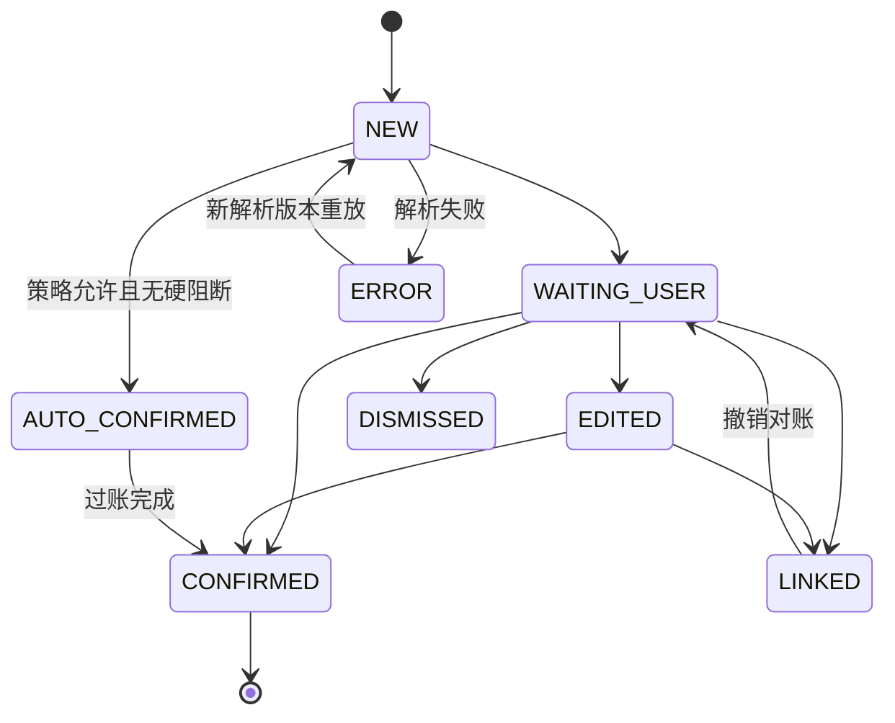

# 采集、确认与对账规格

- 状态：部分实现；通用显式证据复核与用户确认的基础对账已实现，provider 流程待样本验证
- 所有者：项目维护者
- 最后核验：2026-07-30
- 事实来源：MVP 规格、[统一领域模型](../design-docs/domain-model.md)、[ADR-0006](../decisions/0006-provider-neutral-shared-text-evidence-spine.md)、[ADR-0007](../decisions/0007-source-evidence-lifecycle-and-bounded-storage.md)、[ADR-0009](../decisions/0009-wallet-balance-not-inferred-from-bank.md)

## 原则

- 采集只产生证据，不直接产生不可逆账务结果。
- 所有建议说明来源和关键理由；未知字段不以默认值伪装为确定。
- 用户修改、合并、拆分和撤销是正式领域行为，有审计记录。
- 支付宝、微信和银行共用交互；来源差异只显示为证据和能力差异。

## Provider 通知采集流程（目标，尚未实现）

下面描述首个真实 provider route 的目标流程。当前代码只有生产空目录、默认关闭开关、包名/渠道/类别元数据门、持久观察去重和有界队列；尚无按真实通知标题/正文模板限定的支付宝、微信或银行 route，也没有真实脱敏样本。因此现有底座不能被表述为“已抓取指定 App 通知”。

1. 用户从来源设置页选择允许监听的 App，并跳转系统授权。
2. 收到通知后先按包名允许列表过滤；非目标内容不持久化。
3. 对目标通知计算摘要、保存必要字段和捕获元数据，生成 `RawEvent`。
4. 对应适配器解析并标准化，产生待复核来源建议或明确的 `ERROR` 诊断；不得绕过 Draft/确认链直接过账。
5. 按确认策略通知用户；系统限制或权限失效显示在来源健康页。

通知模板属于尽力支持，不能作为历史完整性保证。通知缺失不证明“没有交易”：用户点击领取红包、发送红包或个人转账不会因为动作本身自动产生 `NotificationListener` 回调。金额缺失、只有“红包”提示、或没有“已进入本人余额”状态的观察必须停在数据缺口，不能猜测入账。

没有已验证的 provider 模板时，包名允许列表也不能成为保存微信或支付宝所有通知正文的理由；混合聊天/支付 App 必须先完成模板与隐私范围验证。

## 当前通用显式文本证据切片

- Android `ACTION_SEND text/plain` 只作为用户显式提供的一份 `GENERIC/SHARE_TEXT` 证据；不从任意文本猜测支付宝、微信、金额、方向或账户。
- Android `OpenDocument` 的纯文本证据路径接收用户当次选择的 `text/plain`、CSV 或 TSV 小文件，形成一份不透明 `GENERIC/STATEMENT_IMPORT` 证据；URI 和原文件名不持久化，内容在 64 KiB 上限内立即复制到同一私有证据链。
- 捕获依次写入 app-private 文件、不可变 `RawEvent`、版本化 `ParseAttempt` 和待复核来源建议；重复观察只提示，不自动合并或记账。
- 通用建议必须由用户补全类型、金额和真实资金账户后才能形成 Draft，再沿共享账本确认链生成平衡 Entries。
- 这条纯文本路径仍是“一份不透明文本证据 → 人工复核”，不执行 CSV 多行解析、provider 识别或自动过账；结构化 CSV/TSV 显式映射是下面的另一条已实现路径。两类入口都只证明来源中立的编排、失败诊断和人工回退，不等于任何支付机构或银行已经稳定支持。

## 当前来源中立结构化文件导入流程

1. 用户经 SAF 当次选择 UTF-8 CSV 或 TSV，并明确分隔格式；应用不持久化 URI、文件名或授权。
2. 系统在 2 MiB、5000 数据行、64 列等硬门内解析；未知表头不自动猜列或 provider。
3. 用户显式映射日期、金额、方向、对方和可选交易号，选择日期/数字格式、方向值与 CNY/USD；预览只显示有界样例和安全计数。
4. 用户确认整份映射后写入 `ImportBatch`；每个有效行生成独立 `GENERIC/STATEMENT_IMPORT` 证据、`RawEvent`、解析尝试和待复核建议，预填金额、方向、发生时间与对方。
5. 拒绝行只保留安全错误码；停止或进程中断后，同一文件摘要与映射摘要只续传缺失行，不覆盖已完成证据。
6. 正式交易仍须用户逐条选择同币种资金账户并确认。当前没有 provider 预设、自动账户映射或自动过账；这些仍需真实脱敏样本和独立回放测试。

## 草稿状态

状态转换必须幂等。`LINKED` 表示证据已并入另一经济事件，不等同于删除。

## 当前基础对账切片

- 待复核 Draft 可在本机得到三类建议：两个本人资产账户之间的相反方向转账、银行卡支出改作信用卡还款、收入 Draft 关联既有支出作为退款。
- 金额、币种、方向、账户角色和关系特定时间窗是硬门，不是关系已成立的证明；每条建议都要求用户显式确认。
- 确认前展示账务影响：转账不计普通收支，还款不产生第二笔支出，退款冲减原支出且累计不能超额。
- 确认事务同时保存平衡 Entries、Draft 链接、退款关系、审计与幂等回执；中途失败不保留半笔结果。
- 撤销只作废替代交易并恢复 Draft，不删除 RawEvent、来源证据、关系或审计历史。
- 候选计算有 500 条近期 Draft、每条 3 个和全局 50 个的本机资源上限；上限外内容仍保留正常人工复核路径。

该切片不是 provider 双计消除、pending/posted 合并、钱包绑卡推断或自动对账。上述能力仍须真实脱敏样本、独立关系硬门和回放测试。

## 证据文件生命周期

- `RawEvent`、解析尝试、建议、Draft provenance 与审计是结构化历史；文件载荷使用独立的 `AVAILABLE -> CLEAR_PENDING -> CLEARED` 状态机。
- 默认保留 30 天，用户可选 7、30、90 天或永久；容量上限按已提交生命周期与暂存租约合计 16 MiB/512 条执行。
- 自动保留和容量清理不触碰仍为 `WAITING_USER` 的来源建议。用户主动清除需二次确认，并会先 dismiss 对应待复核建议。
- 删除文件与写入 `CLEARED` 分为两阶段；删除失败保持 `CLEAR_PENDING`，重启维护或用户重试继续处理。
- 清除文件不可撤销，但不删除结构化来源链、已完成 Draft provenance 或追加式审计；设置页不得回显原始财务文本。

## 硬阻断条件

即使总置信度很高，以下情况也不能自动确认：

- 金额/币种缺失或不合法。
- 账务类型会导致分录不平衡。
- 疑似重复但候选之间冲突。
- 真实资金账户未知且会影响资产/负债方向。
- 钱包余额内资金变化只有银行侧证据，或只有不含金额/完成状态的通知。
- 红包/个人转账仍处于未领取、未接受、过期或原路退还状态。
- 来源格式版本未知、导入完整性校验失败。
- 用户已对相同证据作过不同决定。

## 确认面板验收

- 可分开编辑经济类型、渠道和真实资金账户。
- 显示来源、采集方式、时间、金额、商户和置信解释。
- 支持分类、标签、备注、拆分、关联已有交易和留在草稿。
- 保存前预览账务影响；还款/转账明确提示“不计入普通收支”。
- 保存、自动确认、批量关联均可撤销，撤销不会删除原始证据。
- 大字号、TalkBack 和深色模式可用，敏感信息支持一键遮罩。

## 对账工作台

按以下优先级分组：

1. 疑似双计：支付渠道 + 银行扣款、同文件重复、pending/posted。
2. 账务语义：自有转账、充值、信用卡还款、退款。
3. 完整性：账户余额差异、通知捕获空窗、导入失败。
4. 低置信分类/商户规范化。

每个建议展示匹配证据、分数分解和结果预览；危险合并需要显式确认。

## 端到端验收场景

- 支付宝绑招商借记卡消费，支付宝与银行各产生一份证据，最终只有一笔支出。
- 微信绑信用卡消费后又发生还款：消费一次计入支出，还款只减少银行资产与信用卡负债。
- 微信零钱收到未领取红包：不创建收入；领取后如有可验证的钱包证据才进入待复核。
- 微信余额内发出红包/个人转账：不得由银行卡记录替代；缺少钱包证据时显示数据缺口。
- 相同商户同金额连续消费两次不会因粗糙规则被误合并。
- 同一微信账单导入两次，第二次显示零新增且保留第一次用户修改。
- 未知银行文件只进入映射/错误预览，不写正式账本。
- 部分退款和多次退款可分别关联原消费，净额正确。
